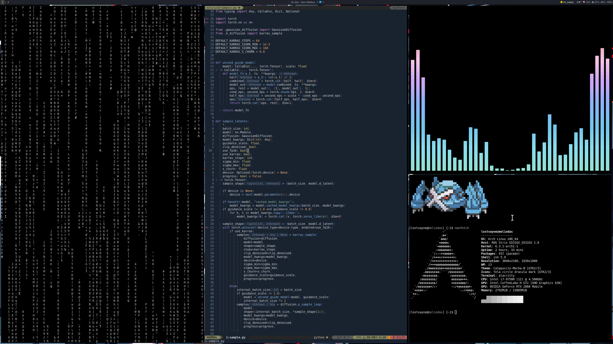

# lets see what we want ?

## We can go Debian or Arch - 

  #### Debian
  ##### i3 + nvim + vscode + polybar/i3status default + rofi + alacritty(with tmux) + c-tools + python-tools + cuda-tools + tensorflow + pytorch + spark
   - Move to Hyprland once Wayland + WLROOTS is stabled on ubuntu ig ?
   - Ubuntu 24.04 onwards we have yaml setups - can use this for default ubuntu setup - have to find a reference

  ### Arch
  ##### Hprland + polybar + rofi + alacritty(tmux choice)/kitty + nvim + vscode + c-tools + python-tools + cuda-tools + tensorflow + pytorch + spark
   - can be referenced from bugswrite arch script - easy https://github.com/Bugswriter/arch-linux-magic

##### Shell - zsh
##### Wallpaper tool - feh
##### Browser - chrome
##### Databases - hive, postgres, monet
##### Infrastructure - docker for playing, prolly a 1 core 2gb cluster 3 node cluster ?
##### Micel - coding fonts -> Nerd Fonts + spotify

```bash
sudo apt-get install/sudo pacman -S git, gcc, g++, python3.13, make, cmake, clangd, ssh
```

## Ref to my previous i3 + Ubuntu v2 setup showcase on unix porn - https://www.reddit.com/r/unixporn/comments/1858mhp/i3_guess_v2_to_my_original/


## Ref to my previous i3 + Ubuntu v1 setup showcase on unix porn - https://www.reddit.com/r/unixporn/comments/13dmsfp/i3_my_first_rice_with_i3/

#### dotfiles for this v1 ref -> https://github.com/meliodas0n/dotfiles


